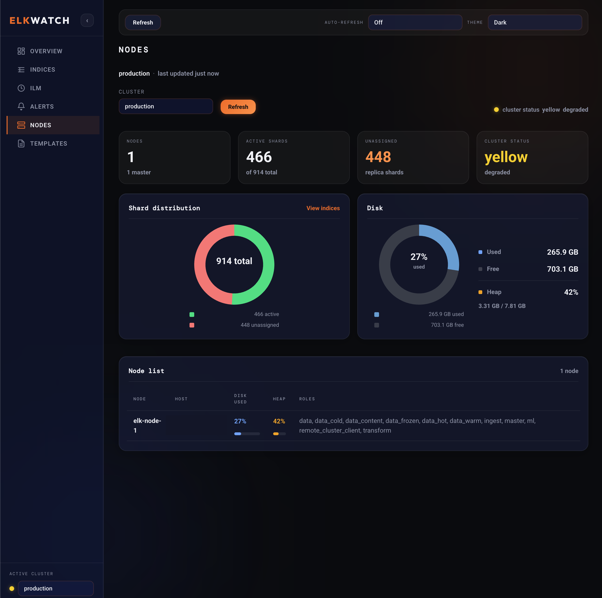

# Elkwatch

A self-hosted Elasticsearch cluster health dashboard with first-class ILM visibility, ingest monitoring, and Slack alerting. Runs as a single `docker-compose up`.



---

## Why Elkwatch?

Kibana's Stack Monitoring is powerful but heavyweight and requires a full Elastic Stack subscription for some features. Elkwatch is a focused, lightweight alternative for teams who just want to know:

- Is my cluster healthy right now?
- Which indices are stuck in an ILM phase — and why?
- Has ingest silently stopped on any index?
- What's eating my disk?

If you've ever had an ILM rollover fail silently, hit the `max_shards_per_node` limit, or spent 20 minutes figuring out why logs stopped appearing — this is built for you.

---

## Features

- **Cluster overview** — status, node count, shard allocation, disk usage across multiple clusters
- **Nodes** — per-node disk and JVM heap from `_nodes/stats` (read-only)
- **Index templates** — composable index templates (read-only viewer)
- **Index browser** — sortable by size, doc count, age, health; supports wildcard filtering
- **ILM monitor + dry-run policy editor** — per-index phase/action/step visibility, failed step highlighting, and read-only policy diff validation
- **Ingest rate tracking** — docs/sec over time per index; flags indices that have gone silent
- **Configurable alerts** — disk threshold, ILM errors, ingest stalls; all delivered to Slack
- **Multi-cluster support** — manage production, staging, and any other clusters from one dashboard
- **Global refresh controls** — manual refresh + auto-refresh interval selector (with pause on hidden tabs)
- **Theme support** — dark/light theme toggle in the top bar
- **Prometheus `/metrics`** — process + `elkwatch_configured_clusters_total` (scrape via nginx or backend port)
- **Zero dependencies at runtime** — just Docker

---

## Quick Start

**1. Clone and configure**

```bash
git clone https://github.com/YOUR_USERNAME/elkwatch.git
cd elkwatch
cp config.yml.example config.yml
```

Edit `config.yml` with your cluster details (see [Configuration](#configuration)).

**2. Run**

```bash
docker-compose up -d
```

**3. Open**

```
http://localhost:3000
```

---

## Configuration

`config.yml` is mounted into the backend container at runtime. No rebuild needed when you change it — just restart the backend service.

```yaml
clusters:
  - name: production
    url: https://your-es-host:9200
    auth:
      type: basic          # basic | api_key | none
      username: elastic
      password: changeme

  - name: staging
    url: http://staging-es:9200
    auth:
      type: none

alerts:
  slack_webhook_url: "https://hooks.slack.com/services/..."
  rules:
    - name: "Ingestion stalled"
      type: ingest_stall
      index_pattern: "logs-*"
      threshold_minutes: 60

    - name: "Disk usage high"
      type: disk_usage
      threshold_percent: 80

    - name: "ILM error"
      type: ilm_error
      enabled: true
```

### Auth types

| Type | Required fields |
|---|---|
| `basic` | `username`, `password` |
| `api_key` | `key` |
| `none` | — |

### Alert types

| Type | Triggers when |
|---|---|
| `ingest_stall` | An index matching `index_pattern` has not received new docs within `threshold_minutes` |
| `disk_usage` | Cluster disk usage exceeds `threshold_percent` |
| `ilm_error` | Any index has a `failed_step` in its ILM explain output |

Alerts are checked every 5 minutes. History is available in the Alerts tab.

---

## Architecture

```
┌─────────────────┐        ┌──────────────────────┐
│  React Frontend │──────▶ │  Express Backend      │
│  (Vite + nginx) │  /api  │  :3001                │
└─────────────────┘        │                       │
                           │  ┌─────────────────┐  │
                           │  │ Alert Scheduler │  │
                           │  │ (node-cron 5m)  │  │
                           │  └────────┬────────┘  │
                           └───────────┼────────────┘
                                       │
                    ┌──────────────────┼──────────────────┐
                    ▼                  ▼                   ▼
             ES Cluster 1      ES Cluster 2        Slack Webhook
```

The backend proxies all Elasticsearch API calls — your cluster credentials never touch the browser.

---

## Development

**Prerequisites:** Node 20+, Docker

```bash
# Backend
cd backend
npm install
cp ../config.yml.example ../config.yml   # edit with local ES details
npm run dev                               # starts on :3001 with nodemon

# Frontend (separate terminal)
cd frontend
npm install
npm run dev                               # starts on :5173 with HMR
```

The Vite dev server proxies `/api` to `localhost:3001` automatically.

### Local dev ELK environment (Elasticsearch + Kibana + Logstash)

For local development (especially for ILM/indices/nodes screens), you can spin up a single-node Elasticsearch plus Kibana and Logstash:

```bash
docker-compose -f docker-compose.dev.yml up -d
```

This starts:

- **Elasticsearch**: `http://localhost:9200`
- **Kibana**: `http://localhost:5601`
- **Logstash**: Beats input on `:5044`, monitoring API on `:9600`

Notes:

- Security is disabled in this dev stack (`xpack.security.enabled=false`), so set your cluster auth to `none`.
- Data is persisted in a Docker volume named `esdata`. To wipe the dev cluster completely:

```bash
docker-compose -f docker-compose.dev.yml down -v
```

#### Point Elkwatch at the dev cluster

If you run the **backend on your host** (`npm run dev`), use:

```yaml
clusters:
  - name: dev
    url: http://localhost:9200
    auth:
      type: none
```

If you run the **Elkwatch backend container** via `docker-compose up`, use the container DNS name:

```yaml
clusters:
  - name: dev
    url: http://elasticsearch:9200
    auth:
      type: none
```

---

## Deployment on AWS (Terraform)

A minimal Terraform module is included to spin up an EC2 instance with Docker and Elkwatch pre-installed.

```bash
cd terraform
cp terraform.tfvars.example terraform.tfvars  # set region, key_name, etc.
terraform init
terraform apply
```

The output will print the public IP. Access Elkwatch at `http://<public-ip>:3000`.

> **Note:** The default security group allows port 3000 from `0.0.0.0/0`. Restrict this to your IP in production, or put it behind an ALB with HTTPS.

---

## API Reference

| Method | Path | Description |
|---|---|---|
| `GET` | `/api/clusters` | Health summary for all clusters |
| `GET` | `/api/indices/:cluster` | Index list with stats |
| `GET` | `/api/ilm/:cluster` | ILM policies and per-index phase status |
| `POST` | `/api/ilm/:cluster/dry-run` | Validate ILM policy JSON and return structural diff (no writes) |
| `GET` | `/api/alerts` | Recent alert history (last 100) |
| `GET` | `/api/nodes/:cluster` | Per-node filesystem and JVM heap stats |
| `GET` | `/api/templates/:cluster` | Composable index templates (names, patterns, `composed_of`) |
| `GET` | `/metrics` | Prometheus text exposition |
| `GET` | `/health` | Backend liveness check |

---

## Versioning & Releases

Elkwatch uses Semantic Versioning and git tags for releases.

- Version format: `MAJOR.MINOR.PATCH` (e.g. `0.1.0`)
- Release tags: `vMAJOR.MINOR.PATCH` (e.g. `v0.1.0`)
- Changelog: see [`CHANGELOG.md`](CHANGELOG.md)

### Release process

1. Update versions and changelog entries.
2. Commit release changes.
3. Tag the release commit.
4. Push commit + tag and create a GitHub Release from that tag.

Example:

```bash
git add .
git commit -m "release: v0.1.0"
git tag -a v0.1.0 -m "Release v0.1.0"
git push origin main
git push origin v0.1.0
```

---

## Roadmap

Done in-tree:

- [x] Index template viewer (read-only)
- [x] Per-node disk breakdown
- [x] Prometheus metrics endpoint (`GET /metrics`)
- [x] ILM policy editor (dry-run mode)

Still open:

- [ ] Persistent alert history (SQLite)
- [ ] Auth / login wall for the dashboard itself

PRs welcome.

---

## License

MIT
